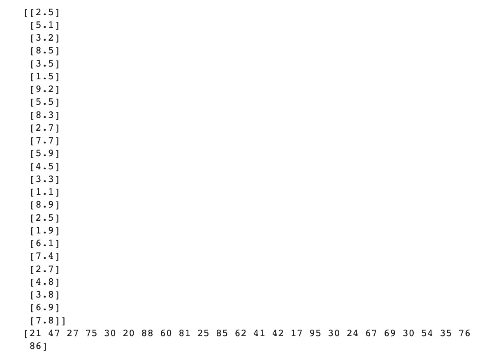
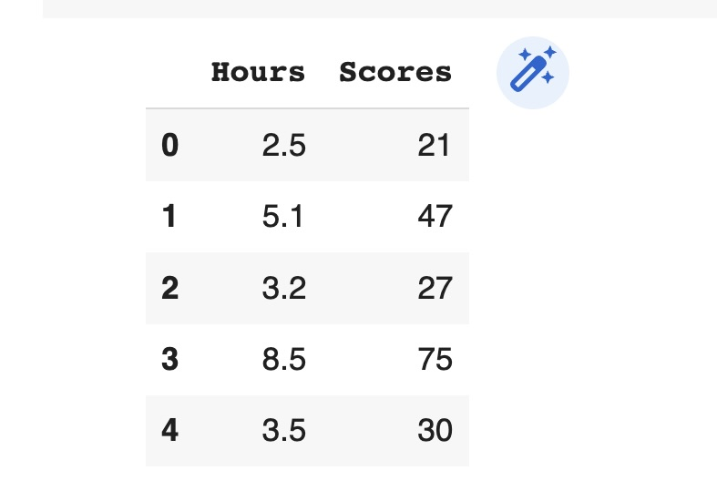

# Implementation-of-Simple-Linear-Regression-Model-for-Predicting-the-Marks-Scored

## AIM:
To write a program to predict the marks scored by a student using the simple linear regression model.

## Equipments Required:
1. Hardware – PCs
2. Anaconda – Python 3.7 Installation / Jupyter notebook

## Algorithm
1. Import the needed packages
2. Assigning hours To X and Scores to Y

3. Plot the scatter plot

4. Use mse,rmse,mae formmula to find
## Program:
```
/*
Program to implement the simple linear regression model for predicting the marks scored.

Developed by: K.Jhansi
RegisterNumber: 212221230045 
*/
import numpy as np
import pandas as pd
dataset=pd.read_csv("student_scores.csv")
print(dataset.iloc[0:10])
x=dataset.iloc[:,:-1].values
y=dataset.iloc[:,1].values
print(x)
print(y)

dataset.head()

dataset.tail()

from sklearn.model_selection import train_test_split
x_train,x_test,y_train,y_test=train_test_split(x,y,test_size=1/3,random_state=0)
from sklearn.linear_model import LinearRegression
reg=LinearRegression() 
reg.fit(x_train,y_train)

y_pred=reg.predict(x_test)
import matplotlib.pyplot as plt
from sklearn.metrics import mean_absolute_error,mean_squared_error
plt.scatter(x_train,y_train,color='blue')
plt.plot(x_train,reg.predict(x_train),color='red')
plt.title('Training set(H vs S) ')
plt.xlabel('Hours')
plt.ylabel('Scores')

y_pred=reg.predict(x_test)
import matplotlib.pyplot as plt
from sklearn.metrics import mean_absolute_error,mean_squared_error
plt.scatter(x_test,y_test,color='blue')
plt.plot(x_test,reg.predict(x_test),color='red')
plt.title('Test set(H vs S) ')
plt.xlabel('Hours')
plt.ylabel('Scores')

mse=mean_squared_error(y_test,y_pred)
print("MSE ",mse)
mae=mean_absolute_error(y_test,y_pred)
print("MAE ",mae)
rmse=np.sqrt(mse)
print("RMSE ",rmse)
```
## Output:




## Result:
Thus the program to implement the simple linear regression model for predicting the marks scored is written and verified using python programming.
